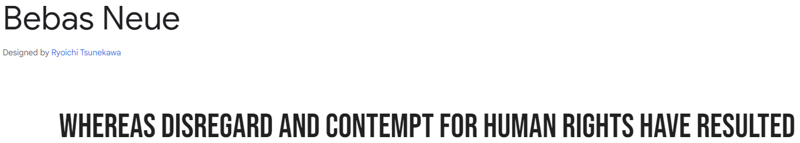
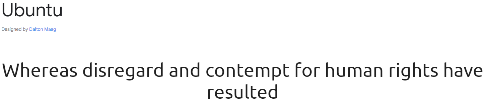
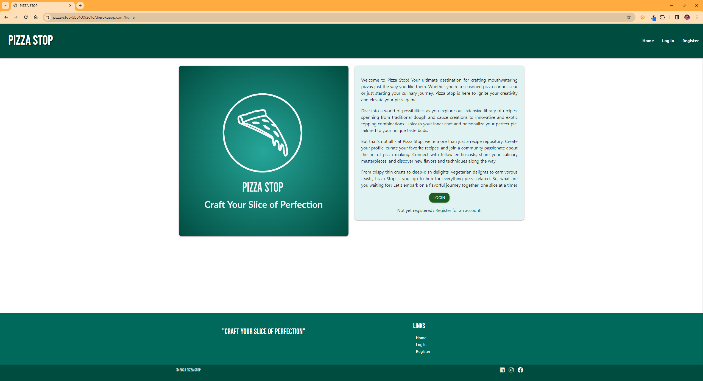
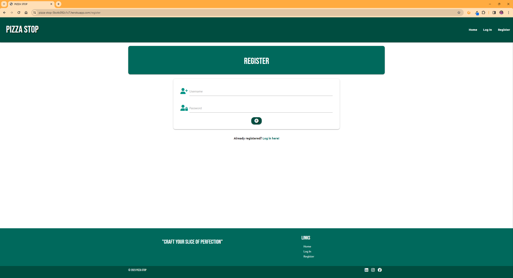
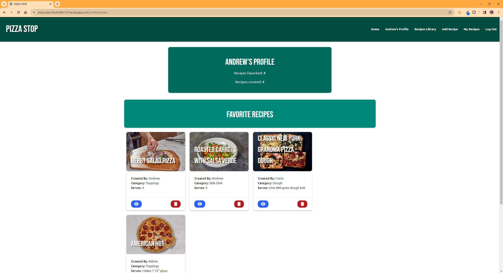
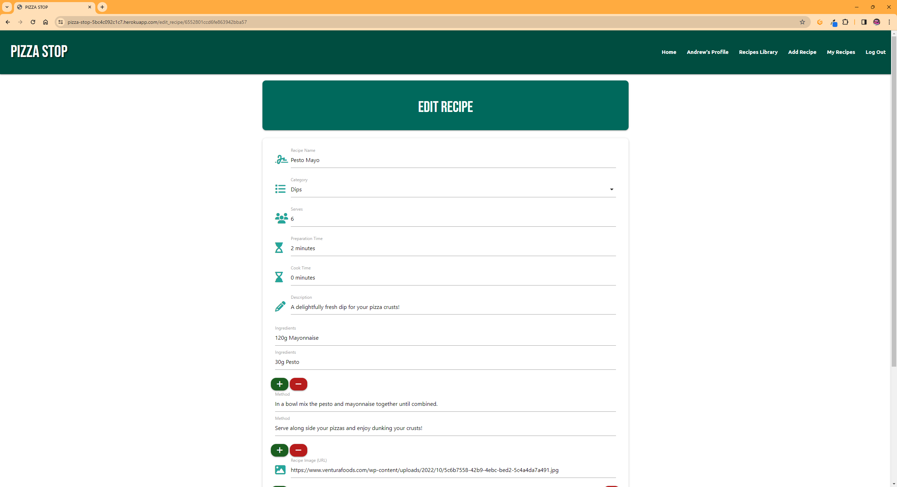

# Pizza-Stop-Milestone-Project-3
## Back End Development Project

For my third milestone project I have designed and developed a website using HTML, CSS and JavaScript, Python, Flask and MongoDB. The purpose of the site is to bring Pizza lovers together to share dough recipes, topping combinations and side dishes. Users are able to create a user profile to upload, amend and delete their own recipes whilst being able to add other users uploads to their recipe collection, but preventing them from deleting or amending them.


[Live version of the site](https://pizza-stop-5bc4c092c1c7.herokuapp.com/)

---
## User Experience (UX) & Design
---
### User Stories
- First Time Visitor

    - As a first time visitor, I would like to be able to understand the purpose of the website.
    - As a first time visitor, I would like to register for a free account.
    - As a first time visitor, start browsing the existing recipes.

- Returning Visitor

    - As a returning visitor, I would like to be able to add existing recipes to my own collection.
    - As a returning visitor, I would like to view a recipe in full.
    - As a returning visitor, I would like to be able to create a new recipe or amend and/or delete recipes I have created.

- Website Administrator

    - As the website administrator, I would like to be able to manage the list of users registered to the site.

### Color Scheme
The colors selected for the color palette are based on the Materialize color palette, specifically the teal palette:


### Typography
Google Fonts was used to import the 'Bebas Neue' and the 'Ubuntu' fonts into the style.css file for use across all pages.





### Wireframes
For all wireframes please see [WIREFRAMES.md](WIREFRAMES.md)

### Data Design
As this is a data driven project I planned how the data would appear in the database and connect with each other and then via the user on the front end. This was done using a non-relational database.

categories:

```
{
    "_id": ObjectId,
    "category_name": string
}
```


recipe_repository:

```
{
    "_id": ObjectId,
    "recipe_name": string,
    "recipe_category": [
        // From categories
        "category_name": string,
    ],
    "recipe_serves": string,
    "recipe_prep_time": string,
    "recipe_cook_time": string,
    "recipe_description": string,
    "recipe_ingredients": [
        // Multiple strings held in an array
    ],
    "recipe_method": [
        // Multiple strings held in an array
    ],
    "recipe_image": string,
    "recipe_submitted_by": string
}
```

users:
```
{
    "_id": ObjectId,
    "username": string,
    "password": string,
    "favorites":[
        // From recipe_repository, array to hold mutiple items
        "_id": ObjectId
    ]
}
```

## Features
---

### Home Page
The Home Page is the introduction to the website, providing an insight into its purpose and providing the user the option to login or register.



### Nav bar
The navigation bar is situated at the top of the page on all pages. It changes from a toggle button to a row of options on large screens. Once logged in more options are availabe to the user.


### Footer
The footer is present on each page displays the websites slogan and also displays the same menu options as the header with links to social media profiles.


### Register Page
The Register page is where new users can go to sign up for an account.



### Login Page
Similar to the Register page in styling, the Login page allows an existing user to log into the service and then directs the user to the profile page.


### Profile Page
The Profile page displays the in session users name, the number of recipes they have favorited and the number of recipes they have created. It also shows each recipe favorited in card form



### Recipes Library page
The Recipes Library page displays all recipes in the db in card form. Each card has two buttons, one to view the recipe in full and the other to add to the in session users favorite list.


### Add Recipe page
The Add Recipe page allows an active user that is signed in to submit their own recipes. They can input the title, assign it to one of the categories, provide times for preparation and cooking, number of people served, a description of the recipe, the ingredients with the option of adding or removing items as necessary, the method steps which also allows the option of adding or removing steps as necessary and the option to provide a web link to an image.


### My Recipes page
The My Recipes page displays all user in session created recipes in card form with the same two buttons from the recipes library page, one to view the recipe in full and the other to add to the in session users favorite list.


### View Recipe page
The View Recipe page takes the recipe and displays it full screen for the user. If the user in session created the recipe, they can choose to edit the recipe or if so delete the recipe entierly. Prior to deletion the user is advised that this is nothing they can't undo this action before requiring user input before proceeding with or cancelling the request to delete.


### Edit Recipe page
THe Edit Recipe page allows the user who has created the recipe to be able to edit the recipe with the ability to amend each item within the db, similar to the create recipe page.



### 404 Page
A custom 404 page has been created and assigned via GitHub to load whenever a non-existent page is requested.


## Future Features

---
## Technologies Used
---
### Languages Used
- [HTML5](https://en.wikipedia.org/wiki/HTML5)
- [CSS](https://en.wikipedia.org/wiki/Cascading_Style_Sheets)
- [JavaScript](https://en.wikipedia.org/wiki/JavaScript)
- [Python](https://en.wikipedia.org/wiki/Python_(programming_language))

### Frameworks, Libraries and Programs Used
- [Balsamiq](https://balsamiq.com/) was used for pre-visualisation of the pages.
- [Google Fonts](https://fonts.google.com/) was used to import the the 'Russo One' and 'Exo 2' fonts into the style.css file.
- [Font Awesome](https://fontawesome.com/) was utilised for icons used on the site for the social media icons.
- [Materialize](https://materializecss.com/) was used for responsive grids, navigation elements, cards, CSS and button elements.
- [Git](https://git-scm.com/) was used for version control. I utilised the CLI terminal in Visual Studio to commit and push to GitHub.
- [Visual Studio Code](https://code.visualstudio.com/) was used as the development enviroment to develop the site.
- [GitHub](https://github.com/) was used as the repository for the project after being pushed from GitPod.
- [Heroku](https://www.heroku.com/) was used to deploy the python application.
- [Flask](https://flask.palletsprojects.com/en/3.0.x/) the micro web framework written in Python.
- [Jinja](https://jinja.palletsprojects.com/) the web template engine for the Python programming language
- [Adobe Express](https://www.adobe.com/express/create/logo) used to produce the website image.
- [TINYURL](https://tinyurl.com/app) used to shorten the default image used if no recipe image provided.

---
## Testing
---
All elements of testing conducted, including user stories and function testing, are in the [TESTING.md](TESTING.md) file.

---
## Deployment
---
### How the site was deployed

The site was deployed to GitHub Pages. The steps to deploy are as follows:

- In the [GitHub repository](https://github.com/AHendley84/Pizza-Stop-MIlestone-Project-3), navigate to the Settings tab
- Under the heading "Code and automation", select "Pages".
- From the source section drop-down menu, select the Main Branch, then click "Save".
- The page will be automatically refreshed with a detailed ribbon display to indicate the successful deployment.

The live link can be found [here](https://pizza-stop-5bc4c092c1c7.herokuapp.com/)

### Local Deployment

This project can be cloned or forked in order to make a local copy on your own system.

#### Cloning

You can clone the repository by following these steps:

1. Go to the [GitHub repository](https://github.com/AHendley84/Pizza-Stop-MIlestone-Project-3)
2. Locate the Code button above the list of files and click it
3. Select if you prefer to clone using HTTPS, SSH, or GitHub CLI, and click the copy button to copy the URL to your clipboard
4. Open Git Bash or Terminal
5. Change the current working directory to the one where you want the cloned directory
6. In your IDE Terminal, type the following command to clone my repository:
   - `git clone https://github.com/AHendley84/Pizza-Stop-MIlestone-Project-3.git`
7. Press Enter to create your local clone.

Alternatively, if using Gitpod, you can click below to create your own workspace using this repository.

Please note that in order to directly open the project in Gitpod, you need to have the browser extension installed.
A tutorial on how to do that can be found [here](https://www.gitpod.io/docs/configure/user-settings/browser-extension).

Once the extension is installed or you have it already, click --> [](https://gitpod.io/#https://github.com/AHendley84/Formula-1-Card-Battles)

#### Forking

By forking the GitHub Repository, we make a copy of the original repository on our GitHub account to view and/or make changes without affecting the original owner's repository.
You can fork this repository by using the following steps:

1. Log in to GitHub and locate the [GitHub Repository](https://github.com/AHendley84/Pizza-Stop-MIlestone-Project-3)
2. At the top right of the repository but below the navbar, locate the "Fork" button.
3. Once clicked, you should now have a copy of the original repository in your own GitHub account!

#### Requirements and env

After cloning or forking the repo, the dependancies within the requirements.txt need to be installed using the command `pip3 install -r requirements.txt`

Any other packages installed in the project after cloning or forking the repo can be added to the requirements.txt file by using the command `pip3 freeze --local > requirements.txt`

An `env.py` file will also need to be created at root-level to contain environment variables that should not be pushed to GitHub, the `env.py` file is listed in the `.gitignore` file to ensure this.

The local `env.py` file will look something like below but with values unique to the user where indicated, these will be covered in the [MongoDB](#mongodb) section.

```
import os

os.environ.setdefault("IP", "0.0.0.0")
os.environ.setdefault("PORT", "5000")
os.environ.setdefault("SECRET_KEY", "any string value")
os.environ.setdefault("MONGO_DBNAME", "name of user's mongoDB database")
os.environ.setdefault("MONGO_URI", "user's mongoDB connection string")
```

#### MongoDB

The project uses [MongoDB](https://www.mongodb.com/) non relational database. To connect your repo up to your own database, these are the steps to follow:

1. Sign up for an account with MongoDB.
2. Select a tier, cloud provider and locality (As I am in the UK, I selected Ireland)
3. Select a Cluster Name or Leave default Cluster0 and click create.
4. Navigate to Database Access and set up a new database user. 
5. Select Password as the authentication method and input a username and password, these will be used in the connection string within the env.py file. Only use letters and numbers to avoid connection issues.
6. Select a built in role of read and write to any database.
7. Click Create. 
8. Navigate to Network Access and click Add IP Address.
9. Select whether to add a local IP address or to allow access from anywhere.
10. Confirm.
11. Navigate to Database and click on Browse Collections next to the name of the Cluster set up in step 3.
12. Click Add My Own Data and add a database name and collection name. This database name should be added to the env.py file as the value for "MONGO_DBNAME".
13. Click the plus sign next to the database name to add further collections - You will need a total of four collections within the database: users, recipes, categories and messages. Any different names would need to then be updated everywhere the collections are called in the app.py file.
14. From the Overview tab in the Cluster, click the Connect button. 
15. Follow the connection instructions for your preferred connection method (I chose to connect using the Python Driver)
16. Copy the connection string to the env.py file as the value for "MONGO_URI".

- NOTE: You will need to replace the ``<password>`` placeholder with the user password created in step 5.
- NOTE: I experienced issues when connecting with the above method and found I had to add the database name created in step 12 to the connection string between the / and ? - after this, I experienced no further connection issues.

#### Heroku

To deploy your app on [Heroku](https://www.heroku.com/platform), these are the steps to follow: 

1. Sign up for an account with Heroku.
2. Click New button and select Create New App.
3. Choose a name for your app. This must be unique.
4. Select a region and click Create App.
5. Choose your connection method, I used automatic deployment from GitHub repo. 
6. Make sure your GitHub profile is displayed and search for the repository. You may need to connect to your GitHub account if not completed at registration.
7. Once the repo is found, click connect.
8. Navigate to Settings tab and click on Reveal Config Vars
9. Each variable from the env.py file will need to be replicated here in key value pairs and without quotes e.g. key = ``PORT`` and value = ``5000``
10. Once all config vars are added, you can now navigate back to the deploy tab and click Enable Automatic Deploys, select the branch to deploy and click Deploy.
11. Once complete, you can click Open App to view the live site.
- NOTE: The live site will now update any time changes are pushed to the connected GitHub repository.

---
## Credits & Acknowledgments
---
- Massive thank you to [astral-g](https://github.com/astral-g) for his [Top Trumps Game](https://github.com/astral-g/Top-Trumps-Game) which allowed me to base and modify my own game on.
- Driver and Team Logo images courtsey of skysports.com.
- Driver stats and information courtsey of Formula1.com.
- Carbon fibre background image courtsey of [Freepik.com](https://www.freepik.com/free-photos-vectors/carbon-fibre-texture).
- Background image used in 404.html courtesy of [CNN.com](https://edition.cnn.com/2018/08/30/motorsport/formula-one-crashes-defined-sport-halo-spt-intl/index.html).
- Background image used in player_win.html courtsey of [topgear.com](https://www.topgear.com/car-news/motorsport/tgs-five-favourite-f1-podium-celebrations).
- Background image used in computer_win.html courtsey of [autosport.com](https://www.autosport.com/f1/news/lauda-slams-sabotage-talk-after-hamiltons-malaysian-gp-failure-5033191/5033191/).
- Thanks to [Stack Overflow](https://stackoverflow.com/questions/4919076/outline-effect-to-text) for help on applying the text-shadow to the text on the 404, Player Win and Computer Win pages.
- Credit to [W3 Schools](https://www.w3schools.com/jsref/prop_style_cursor.asp) for the cursor change property guidance.
- Thanks to [GitHub](https://docs.github.com/en/pages/getting-started-with-github-pages/creating-a-custom-404-page-for-your-github-pages-site) for this handy guide to adding your own custom 404 page.
- Thank you to [Joy Zadan on Slack](https://code-institute-room.slack.com/archives/C7HD37Q1F/p1691322584027999) for helping me to resolve the second bug identified in my JavaScript code.