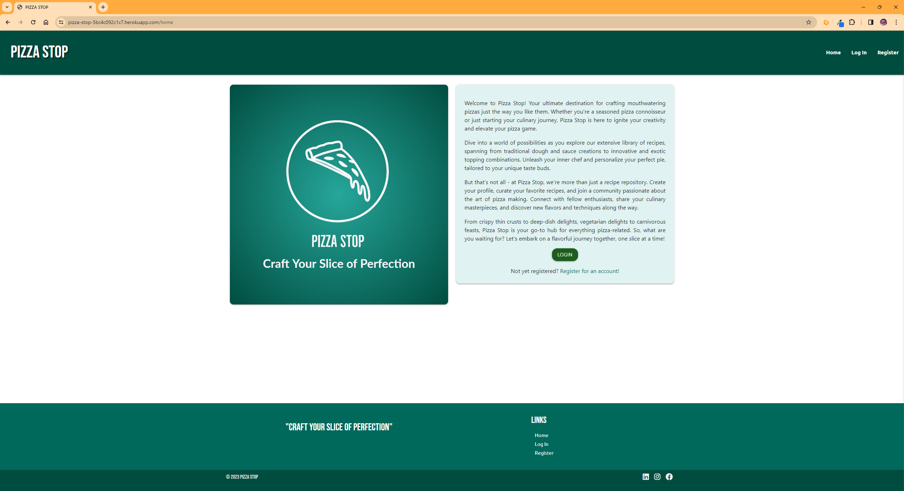
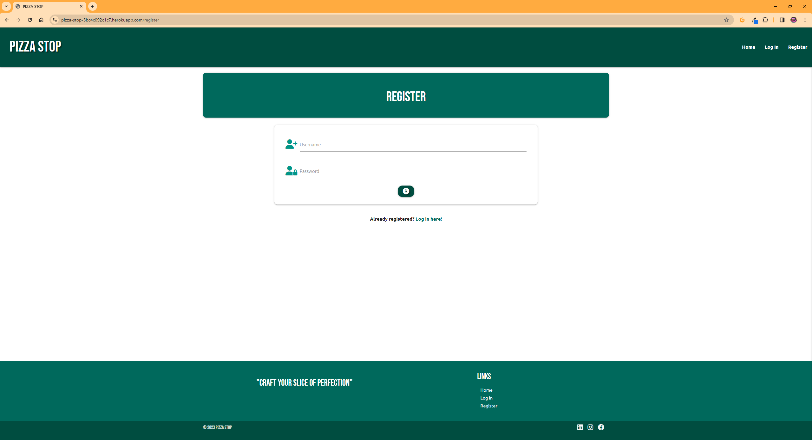
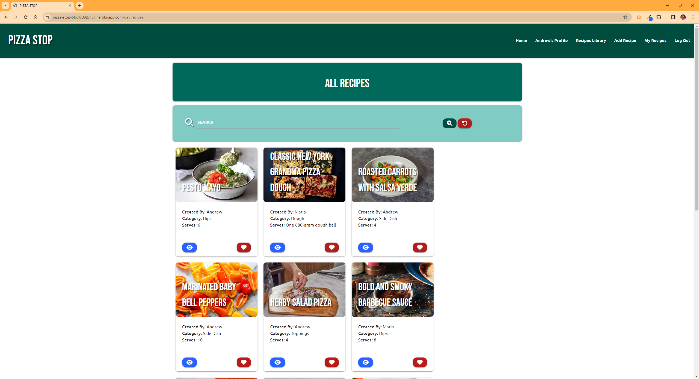
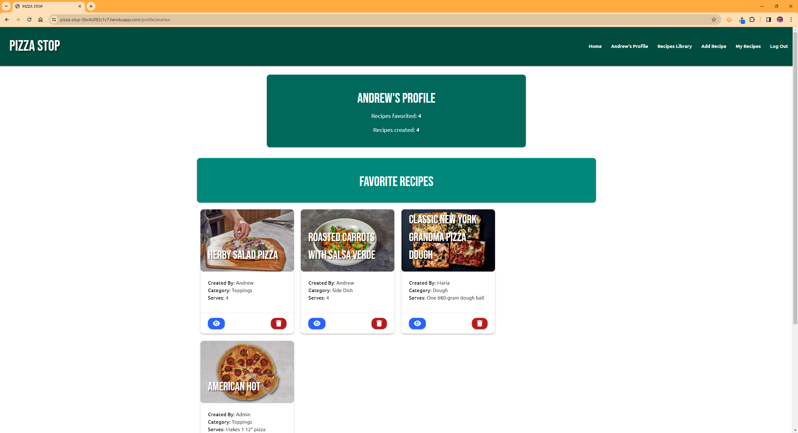
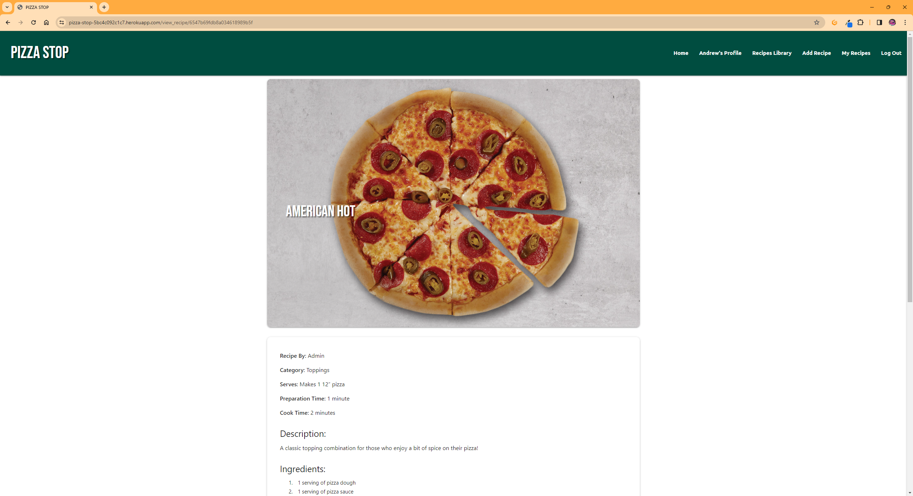
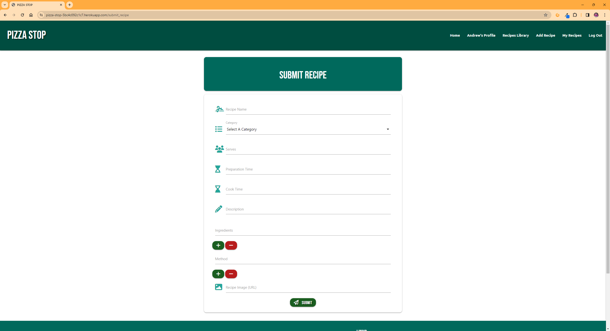
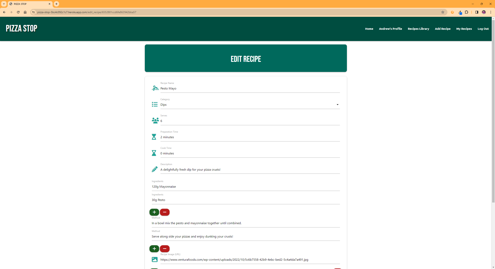
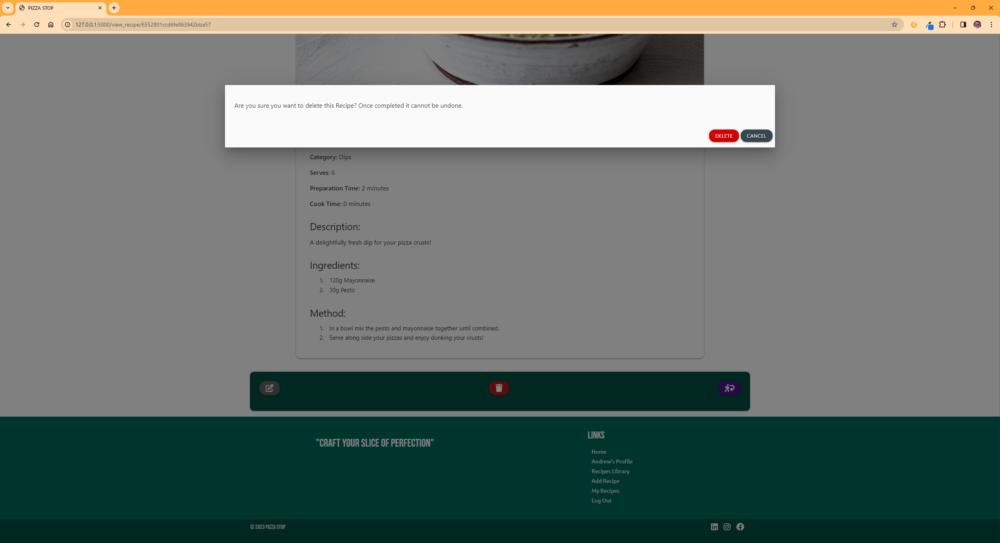
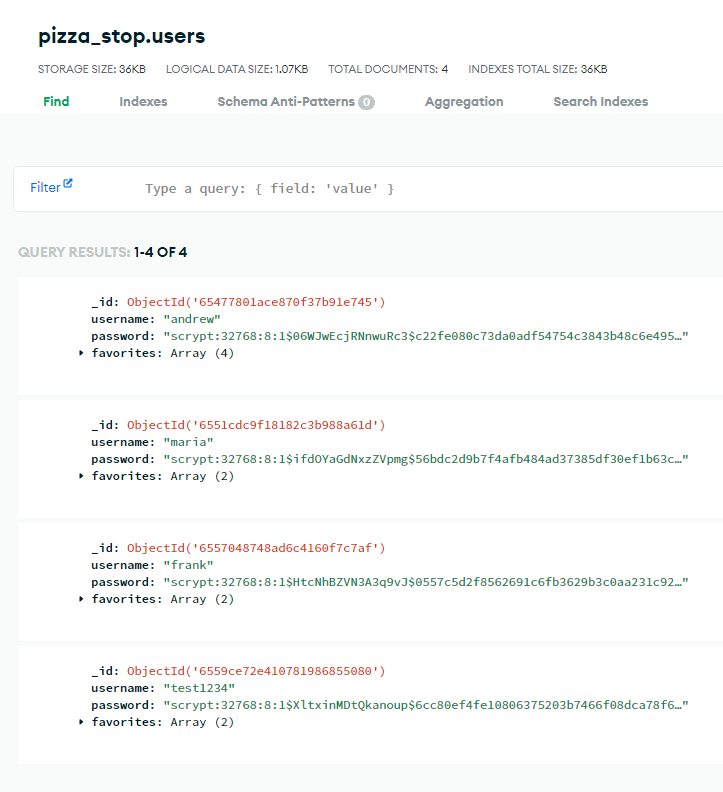

## Testing
---
### Validator Testing
#### HTML
HTML Markup Validator results:
- [Home](documentation/lighthouse/index_mobile.png)
- [Register](documentation/lighthouse/game_mobile.png)
- [Login](documentation/lighthouse/player_win_mobile.png)
- [Profile](documentation/lighthouse/computer_win_mobile.png)|
- [Recipes Library](documentation/lighthouse/computer_win_mobile.png)|
- [Add Recipe](documentation/lighthouse/computer_win_mobile.png)|
- [My Recipes](documentation/lighthouse/computer_win_mobile.png)|
- [View Recipe](documentation/lighthouse/computer_win_mobile.png)|
- [Edit Recipe](documentation/lighthouse/computer_win_mobile.png)|
- [404](documentation/lighthouse/404_mobile.png)|

#### CSS
- The CSS used in this project was tested with [W3c CSS Validation](https://jigsaw.w3.org/css-validator/#validate_by_input) with no concerns.

#### JavaScript
- The JavaScript used in this project has been tested on both [JSLint](https://www.jslint.com/) and [JSHint](https://jshint.com/) with no concerns.

#### Python
- The Python used in this project has been tested on the [CI Python Linter](https://pep8ci.herokuapp.com/) to ensure it is PEP8 compliant.

### Browser Compatibility
The site has been tested on the following browsers (latest builds as of 09/12/2023):
- Google Chrome version Version 120.0.6099.71 (Official Build) (64-bit)
- Mozilla Firefox Version 120.0.1 (64-bit)
- Microsoft Edge Version 119.0.2151.97 (Official build) (64-bit)
- Apple Safari (Latest build on iOS 17.1)

### Manual Testing Results
Here is a table of the manual testing done on the site to determine if all features work as described and designed:

### User Story Testing
|User Story|Screenshot|||
|---|---|---|---|
|**First Time Visitor**|
|As a first time visitor, I would like to be able to understand the purpose of the website.||||
|As a first time visitor, I would like to register for a free account.||||
|As a first time visitor, start browsing the existing recipes.||||
|**Returning Visitor**|
|As a returning visitor, I would like to be able to add existing recipes to my own collection.||||
|As a returning visitor, I would like to view a recipe in full.||||
|As a returning visitor, I would like to be able to create a new recipe or amend and/or delete recipes I have created.||||
|**Website Administrator**|
|As the website administrator, I would like to be able to manage the list of users registered to the site.|At present this is done on the database server side|||

### Feature Testing

### Lighthouse Test
|Page|Device|Lighthouse Result|
|---|---|---|
|Home|Mobile||
|Home|Desktop||
|Register|Mobile||
|Register|Desktop||
|Login|Mobile||
|Login|Desktop||
|Profile|Mobile||
|Profile|Desktop||
|Recipes Library|Mobile||
|Recipes Library|Desktop||
|Add Recipe|Mobile||
|Add Recipe|Desktop||
|My Recipes|Mobile||
|My Recipes|Desktop||
|View Recipe|Mobile||
|View Recipe|Desktop||
|Edit Recipe|Mobile||
|Edit Recipe|Desktop||
|404|Mobile||
|404|Desktop||

### Resposiveness
The website has been tested on multiple web browsers, including Google Chrome, Microsoft Edge and Mozilla Firefox. Google Chrome Developer Tools have been used to simulate multiple different device screen sizes such as iPhone SE, Pixel 5, iPad Air and iPad Mini. It has been tested physically on an iPhone 12 Pro, 3rd Gen iPad and on desktop screens 2560 x 1440 pixels and 1920 x 1080 pixels.

### Bugs
|Bug Number|Expected|Actual|Fix|
|---|---|---|---|
|Bug 1|Nationality should display the drivers Nationality|Nationality on the active computer card was displaying a number|The code was pointing to the number of drivers championships rather than the nationality. Amending the code to look at the nationality inside the active card object resolved the issue|
|Bug 2|The game function should continue until either the computer or the player has all 20 cards|After approximately 10 games the game would stop unexpectedly and the console would display 'Uncaught TypeError: Cannot read properties of undefined (reading 'img1')'|I reached out to the #project-milestone-2 channel for some guidance. After some initial guidance from Joy Zadan I was able to resolve the issue by moving the displayImages and displayDriverStats into the assignCurrentCard function. I was then able to further improve the code with the help of Joy Zadan to a length check of the playerCards and currentCards to ensure they were greater than zero before assigning the next random card available|
|Bug 3|The message and score boards should remain in their own separate containers|Overlapping text between the message board and the scoreboard|the height of the message board container had been set to 30px. I changed this to the minimum height which resolved the issue|

### Unfixed Bugs
As of the 19/08/2023 there are no known bugs present.

Back to [README.md](README.md).