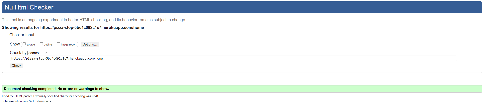
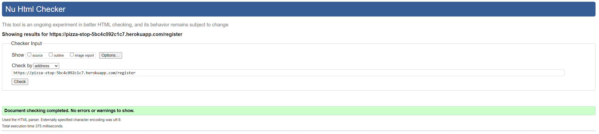
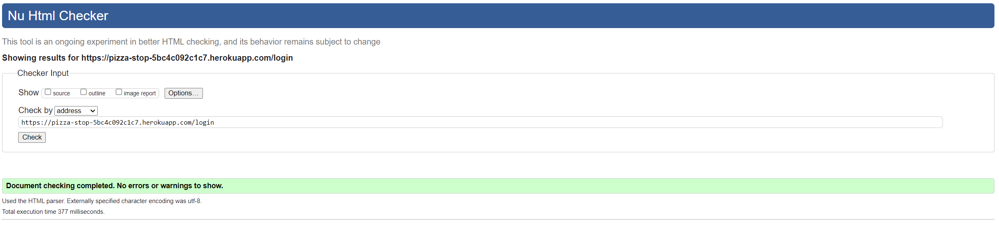
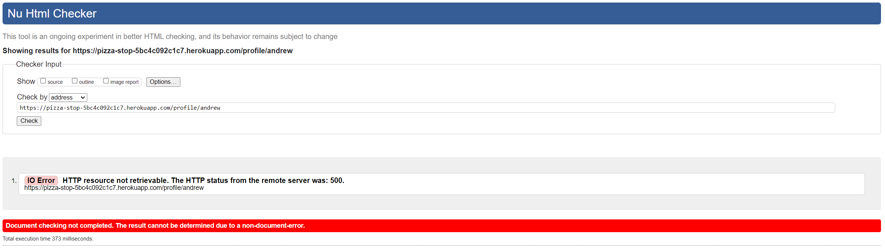
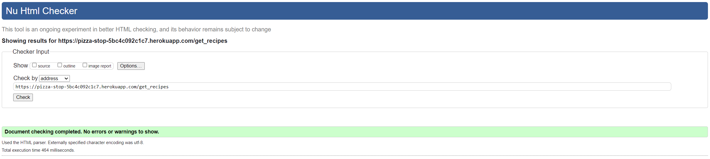
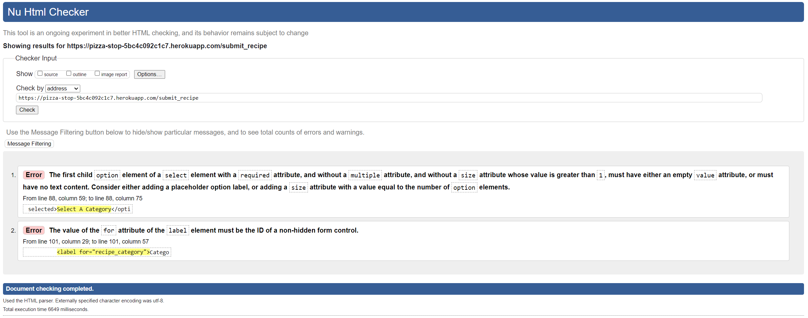
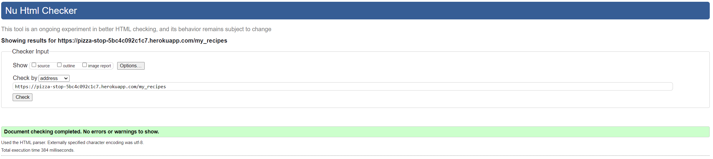
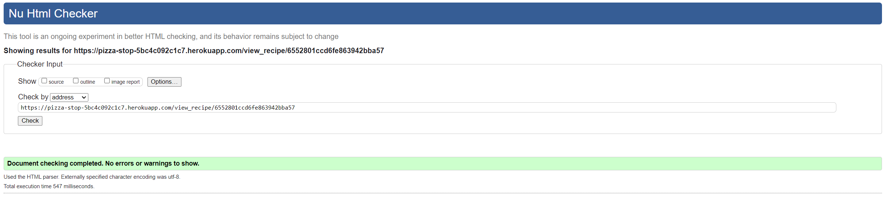
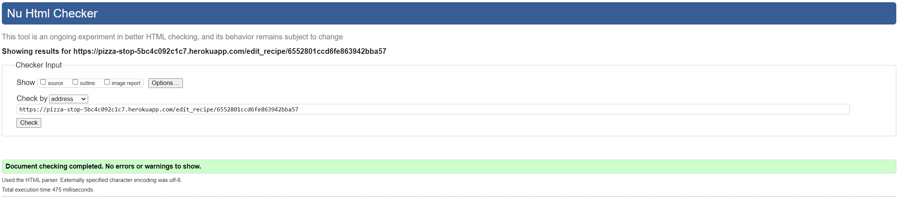
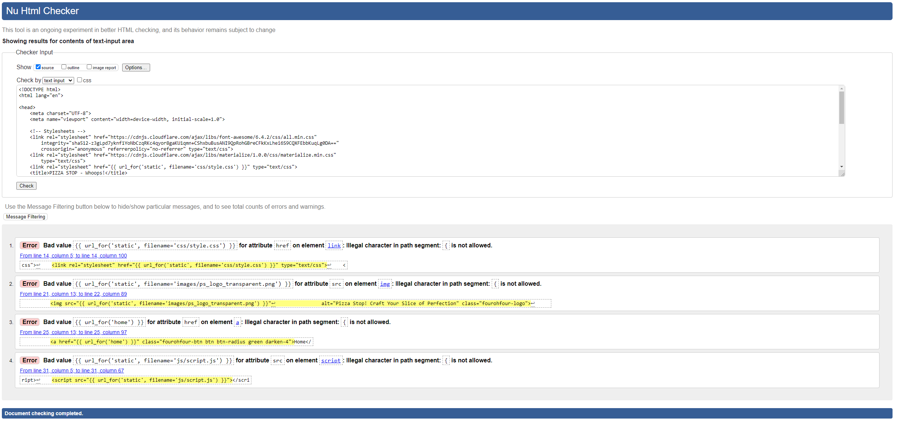

## Testing
---
### Validator Testing
#### HTML
HTML Markup Validator results:

<details>
<summary>Home</summary>

Identified an issue where by a section tag was causing an error on the base template containing the nav bar, footer and flash messages. Changing this to a div tag resolved the error and resulted in no further warnings or errors.


</details>

<details>
<summary>Register</summary>



</details>

<details>
<summary>login</summary>



</details>

<details>
<summary>Profile</summary>

Identified that the ```alt``` tag was missing from the ```img``` attribute, this was easily rectified. The Profile page is failing the W3C check as it wasn't able to  conduct the check with a user logged in, causing a 500 error. However, a direct code input validation, higlighted an erent ```i``` and  ```/div```.


</details>

<details>
<summary>Recipes Library</summary>

Identified that the ```alt``` tag was missing from the ```img``` attribute, this was easily rectified.


</details>

<details>
<summary>Add Recipe</summary>

Identified two errors on the page, both in relation to the drop down menu for the category functions. Attempts to rectify this issue resulted in further errors. I've tested that the dropdown works as it should so the errors remain at present.


</details>

<details>
<summary>My Recipes</summary>



</details>

<details>
<summary>View Recipe</summary>

Identified that the ```alt``` tag was missing from the ```img``` attribute, this was easily rectified. 


</details>

<details>
<summary>Edit Recipe</summary>



</details>

<details>
<summary>404</summary>

Due to the nature of the 404 error, I was unable to submit this through the URL check on W3C. However, I did submit the code via direct code input, and aside from the issues with the Jinja code and a trailing ```/``` on the font awesome link, there are no issues identified.


</details>


#### CSS
- The CSS used in this project was tested with [W3c CSS Validation](https://jigsaw.w3.org/css-validator/#validate_by_input) with no concerns.


#### JavaScript
- The JavaScript used in this project has been tested on both [JSLint](https://www.jslint.com/) and [JSHint](https://jshint.com/) with no concerns.

#### Python
- The Python used in this project has been tested on the [CI Python Linter](https://pep8ci.herokuapp.com/) to ensure it is PEP8 compliant.

### Browser Compatibility
The site has been tested on the following browsers (latest builds as of 09/12/2023):
- Google Chrome version Version 120.0.6099.71 (Official Build) (64-bit)
- Mozilla Firefox Version 120.0.1 (64-bit)
- Microsoft Edge Version 119.0.2151.97 (Official build) (64-bit)
- Apple Safari (Latest build on iOS 17.1)

### Manual Testing Results
Here is a table of the manual testing done on the site to determine if all features work as described and designed:

### User Story Testing
|User Story|Screenshot|||
|---|---|---|---|
|**First Time Visitor**|
|As a first time visitor, I would like to be able to understand the purpose of the website.||||
|As a first time visitor, I would like to register for a free account.||||
|As a first time visitor, start browsing the existing recipes.||||
|**Returning Visitor**|
|As a returning visitor, I would like to be able to add existing recipes to my own collection.||||
|As a returning visitor, I would like to view a recipe in full.||||
|As a returning visitor, I would like to be able to create a new recipe or amend and/or delete recipes I have created.||||
|**Website Administrator**|
|As the website administrator, I would like to be able to manage the list of users registered to the site.|At present this is done on the database server side|||

### Lighthouse Test
|Page|Device|Lighthouse Result|
|---|---|---|
|Home|Mobile||
|Home|Desktop||
|Register|Mobile||
|Register|Desktop||
|Login|Mobile||
|Login|Desktop||
|Profile|Mobile||
|Profile|Desktop||
|Recipes Library|Mobile||
|Recipes Library|Desktop||
|Add Recipe|Mobile||
|Add Recipe|Desktop||
|My Recipes|Mobile||
|My Recipes|Desktop||
|View Recipe|Mobile||
|View Recipe|Desktop||
|Edit Recipe|Mobile||
|Edit Recipe|Desktop||
|404|Mobile||
|404|Desktop||

### Resposiveness
The website has been tested on multiple web browsers, including Google Chrome, Microsoft Edge and Mozilla Firefox. Google Chrome Developer Tools have been used to simulate multiple different device screen sizes such as iPhone SE, Pixel 5, iPad Air and iPad Mini. It has been tested physically on an iPhone 12 Pro, 3rd Gen iPad and on desktop screens 2560 x 1440 pixels and 1920 x 1080 pixels.

### Unfixed Bugs
As of the 10/12/2023 the only known bug present is the issue with the Add Recipe dropdown.

Back to [README.md](README.md).